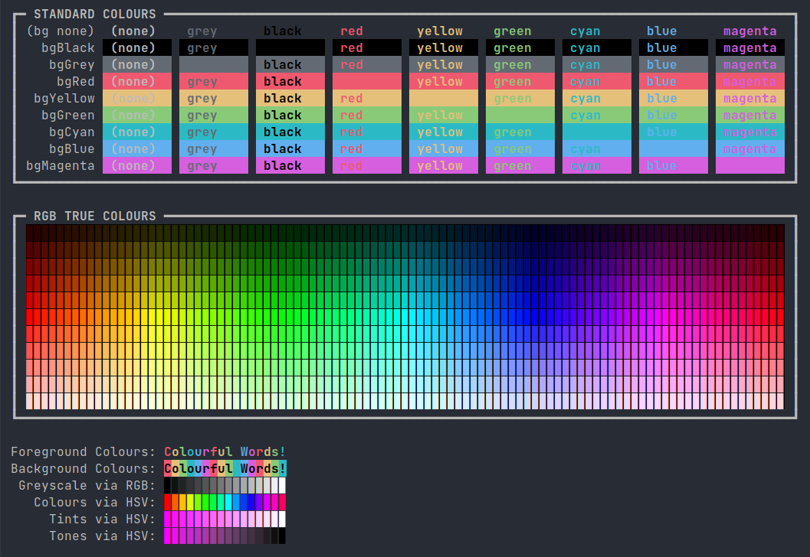
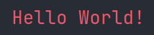
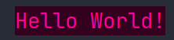

# Kolour for Kotlin

String class extension functions to help with colouring console output using ANSI escape codes: [https://en.wikipedia.org/wiki/ANSI_escape_code](https://en.wikipedia.org/wiki/ANSI_escape_code). Created for students in my coding classes to use.

Provides functions to specify **foreground** and **background** colours, using...
- colour **names**
- **RGB** colour
- **HSV** colour
- **Hex** colour codes

## Installation

Just add **Kolour.kt** to your project and you should be good to go.

Main.kt includes a ```colourTest()``` function that should produce this output, so you can check the compatability of your terminal / IDE:



## Usage - Standard Colours (3-Bit)

A limited set of named colours (compatible with most terminals) is included. (Note that the colours shown are representative of my IDE's colour config - your's will likely look different.)

```kotlin
"Hello World!".red()
```



```kotlin
"Hello World!".yellow().bgRed()
```


```kotlin
"Hello World!".bold().black().bgYellow()
```


A list of the colour functions for standard colours (see notes at end re. bright colours, etc.), both foreground and backgrond:

- ```.normal()``` and ```.bgNone()```
- ```.black()``` and ```.bgBlack()```
- ```.white()``` or ```.grey()``` and ```.bgGrey()```
- ```.red()``` and ```.bgRed()```
- ```.yellow()``` and ```.bgYellow()```
- ```.green()``` and ```.bgGreen()```
- ```.cyan()``` and ```.bgCyan()```
- ```.blue()``` and ```.bgBlue()```
- ```.magenta()``` and ```.bgMagenta()```

Additional styling:

- ```.bold()```
- ```.italic()```
- ```.underline()```

## Usage - True-Colour (24-Bit)

On termnals that support 24-Bit colour, there are a number of functions that allow you to define colours in various, convenient ways:

### RGB Colour

- ```.col(r, g, b)```
- ```.bgCol(r, g, b)```

Where r, g and b are Ints in the range 0 to 255

```kotlin
"Hello World!".col(255, 255, 255).bgCol(50, 75, 100)
```


### HSV Colour

- ```.col(hue, saturation, value)```
- ```.bgCol(hue, saturation, value)```

Where hue, saturation and value are Doubles in the range 0.0 to 1.0

```kotlin
"Hello World!".col(0.9, 1.0, 1.0).bgCol(0.9, 1.0, 0.2)
```



### Hex Colour

- ```.col(hex)```
- ```.bgCol(hex)```

Where hex is a String of the fomat "#rrggbb" or "#rgb"

```kotlin
"Hello World!".col("#ff0").bgCol("#33691e")
```


## Notes

- I haven't bothered with the 'bright' colours as they're rendered so inconsistently by different terminal / IDEs, depending on the config: in some cases the colours are different, others not; sometimes the font is made bold; etc. I've never found the bright colours particularly useful. Easy enough to add them in if you need them.

- I've called the colour which is normally refered to as 'white', 'grey' since it's clearly not white! Likewise for the 'white' background, it's called 'bgGrey'.
